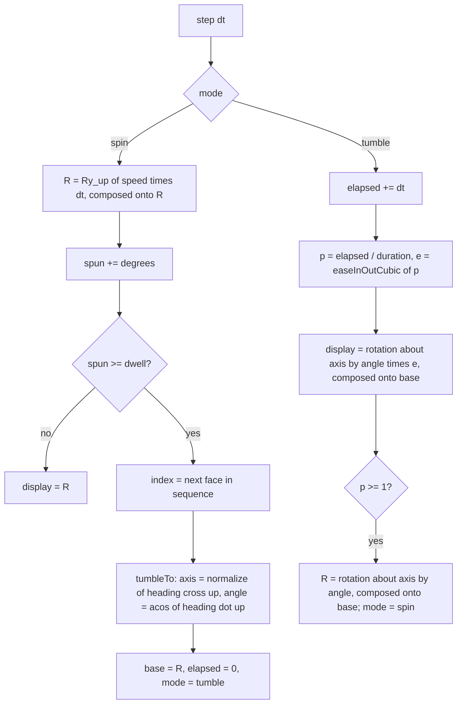

# geometry.js — flow

## One frame of rotation

## Why the spin freezes during a tumble

The tumble's target axis and angle are computed ONCE, at the moment the turn
begins, from where the next face is pointing right then. If the vertical spin
kept running underneath, the face would have moved by the time the turn
finished and would land somewhere other than the top. Freezing the spin for
those 0.7 seconds is what makes the landing exact.

## Duration scales with the journey

A 180-degree turn takes twice the time of a 90-degree one. The shipped face
order never needs a 180 (see `tests/test_face_order.py`), but if one ever
appeared it would read as a deliberate slow flip rather than a snap.
