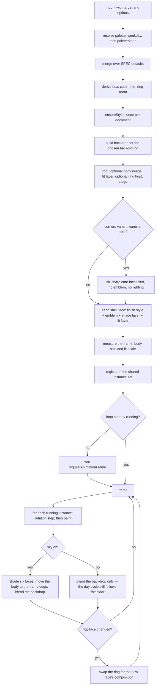

# loading-cube.js — flow

## Mount, then one shared loop

## The ring only rebuilds on a face change

Six times per cycle, not sixty times per second. Between changes the ring is
untouched DOM turning on the compositor, which is why switching it on does not
move the cost meter.

## What the clock touches, and how rarely

Only the day-cycle backdrop, and it compares before it writes: the daylight
fraction is rounded to two decimals, so a still afternoon writes to the DOM zero
times. The frame is read on resize, never per frame — see
[__about/loading-cube.md](../__about/loading-cube.md).

## destroy() stops the world

When the last instance is destroyed the loop is cancelled. A page that mounts
and unmounts cubes (a router, a modal) leaves nothing running behind it.
