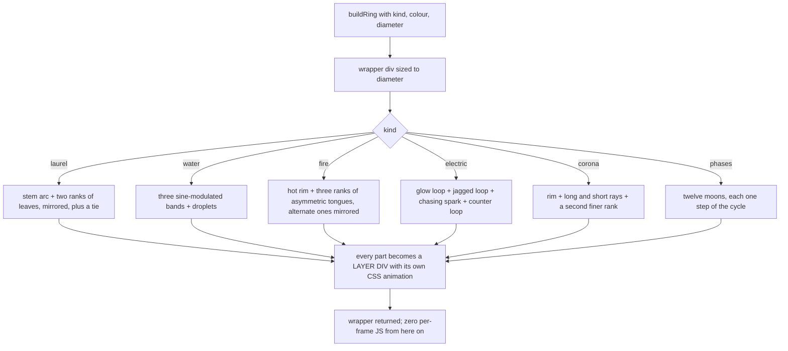

# rings.js — flow

## Building one ring

## The moon-phase path

Each small moon is a dim full disc with the lit part drawn on top. The
terminator is an ellipse whose semi-minor axis is `|cos(2*pi*phase)| * r`:

- `phase < 0.5` is waxing, so the outer half-circle is the RIGHT side;
- the inner elliptical arc bulges the same way as the outer one for a crescent
  and the opposite way for a gibbous, which is the `innerSweep` flag;
- at `phase = 0.5` the ellipse has become a circle and the two arcs close a
  full disc — the full moon falls out of the formula rather than being a
  special case.

## Why layer divs and not SVG groups

An HTML element's transform-origin is its own centre. An SVG `<g>` depends on
`transform-box`, and the first draft got it wrong: the ring orbited the whole
page instead of spinning in place. Inside the SVG only opacity animates.
