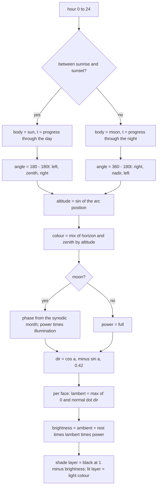
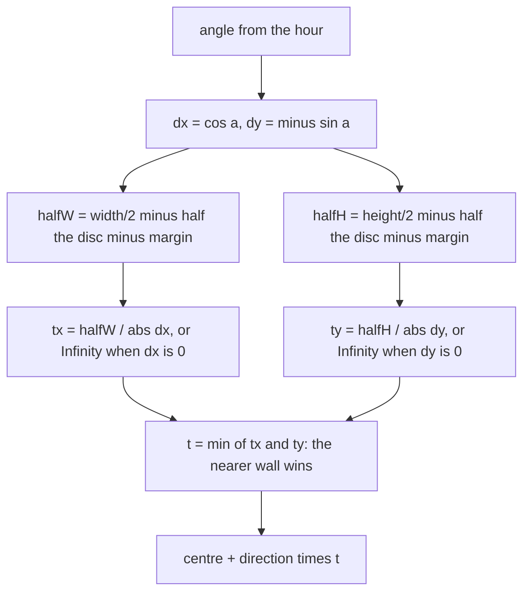

# sky.js — flow

## From a clock reading to a lit cube

## Why the light direction is tipped toward the viewer

A purely in-plane direction would brighten only the silhouette edges: the faces
we actually see point mostly at the camera, so their dot product with a flat
light would sit near zero all the time. The `+0.42` z component gives the
visible faces something to catch while keeping the left/right and up/down
difference the eye is reading.

## Where the body lands

The body is placed by its CENTRE, so the box is shrunk by half the disc plus the
margin BEFORE the intersection — an unshrunk box put half the sun outside the
root, where `overflow: hidden` sliced it off.

Which wall wins depends on the frame's shape, and that is the point. In a wide
16:9 frame the 15:00 diagonal ray reaches the TOP edge first; in a tall 9:16
frame the same hour reaches the SIDE first. Either way the body touches the
frame, which is what the owner asked for — the previous circle touched nothing.
